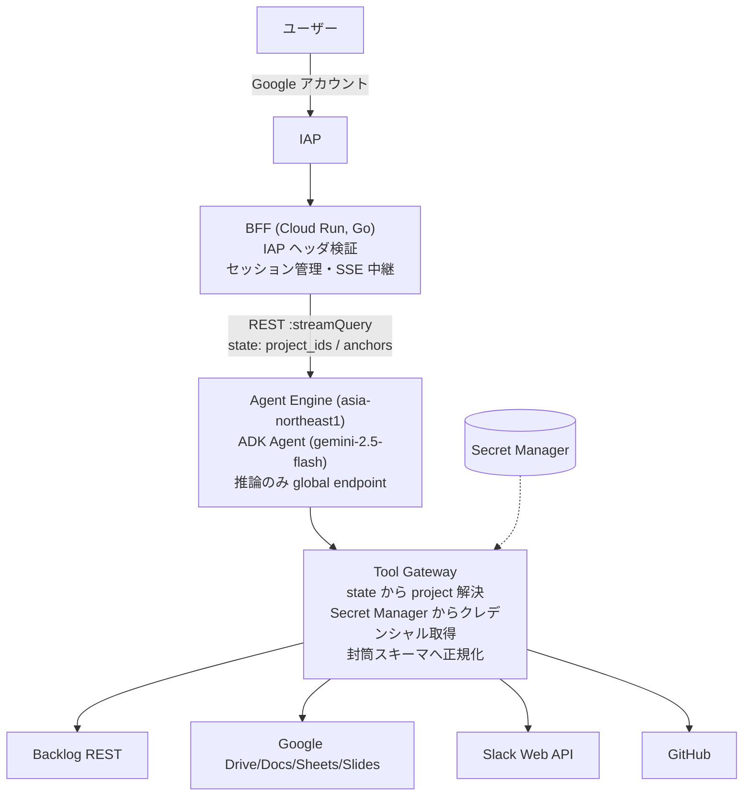

# ws-agent

ワークスペースの情報源(Backlog / Google Workspace / Slack / GitHub)を **読み取り専用** で横断検索・分析するエージェント基盤。

ユーザーが送るあらゆる問い合わせ — 最新仕様の確認、経緯の再構成、開発の進捗、課題の傾向 — に対して、記録そのものに根拠を置いた応答を生成する。

| | |
|---|---|
| エージェント | ADK 1.23 + Vertex AI Agent Engine(gemini-2.5-flash、global endpoint) |
| フロントエンド | Go 製 BFF + 静的 SPA(Cloud Run + IAP) |
| データソース | Backlog(REST)/ GWS Drive・Docs・Sheets・Slides(REST)/ Slack(Web API)/ GitHub |
| 原則 | 全コードパスが read-only。書き込み経路は存在しない |

## アーキテクチャ



設計の中核は **Tool Gateway 方式**: LLM に見せるツールは自前関数のみで `project_id` 引数を持たない。プロジェクトは session state からのみ解決し、`before_tool_callback` がモデル由来の識別子を剥奪する。全ツールの戻り値は封筒スキーマ(`source / projects / fetched_at / complete / failures / count / items`)で、不完全性は常に自己申告される。

## リポジトリ構成

```
ws-agent/
├── agent/                  # Python (uv)。Agent Engine にデプロイされる本体
│   ├── agents/wsagent/
│   │   ├── agent.py        # Agent 組立て(モデル・planner・callback)
│   │   ├── prompts/        # システムプロンプト
│   │   ├── gateway/        # Tool Gateway(封筒・Secret 解決)
│   │   └── tools/          # LLM 可視ツール(backlog / gws / slack / github)
│   ├── scripts/deploy.py   # Agent Engine デプロイ(create/update 自動判別)
│   └── tests/              # 封筒・契約テスト
├── frontend/               # Go BFF + 静的 SPA(Cloud Run)
│   ├── main.go             # IAP 検証・SSE 中継
│   ├── agent.go            # Agent Engine REST クライアント・セッション管理
│   └── deploy.sh           # Cloud Build + Cloud Run デプロイ
├── config/                 # プロジェクトレジストリ(正はここ。秘密は Secret 名参照のみ)
└── docs/                   # OPERATIONS / SECURITY
```

## クイックスタート

```bash
# エージェントのテスト
cd agent && uv run pytest

# エージェントのデプロイ(dry-run で内容確認 → 実行)
uv run python scripts/deploy.py --env dev --dry-run
uv run python scripts/deploy.py --env dev

# BFF のデプロイ
cd frontend && ./deploy.sh dev <agent-engine-resource-name>
```

初期セットアップからの手順、調整値、トラブルシューティングは [docs/OPERATIONS.md](docs/OPERATIONS.md) を参照。

## セキュリティ

アクセス境界は各プラットフォーム側に既に存在する(Backlog のプロジェクト権限、Drive の閲覧権限、Slack のチャンネル参加、GitHub のリポジトリ権限)。本基盤は境界を定義・再実装せず、**プロジェクトが用意したクレデンシャルを預かって使うだけ**の設計とする。詳細は [docs/SECURITY.md](docs/SECURITY.md)。
