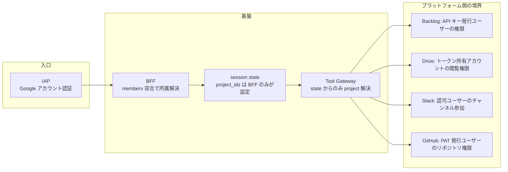

# セキュリティ境界

本基盤のアクセス制御がどこで成立しているかの簡潔な整理。

## 基本原則

**アクセス境界は各プラットフォーム側に既に存在し、本基盤はそれを定義・再実装しない。** 成立条件は 1 つだけ:

> ツールが使うクレデンシャルは、そのプロジェクトが用意したものに限る。

基盤が広い権限を持たず「預かって使うだけ」であれば、プラットフォーム側の境界がそのまま効く。

## 境界の所在

| 層 | 何を決めるか | 実装 |
|---|---|---|
| IAP | 誰が入れるか | レジストリ `members` から同期された `iap.httpsResourceAccessor`(`frontend/sync_iap.sh`) |
| BFF | どのプロジェクトのユーザーか | IAP 検証済みメール × レジストリ `members` の突合。非メンバーは 403 |
| session state | ツールが照会するプロジェクト | `create_session` 時に BFF が設定、以後不変 |
| Tool Gateway | どのクレデンシャルを使うか | state の `project_ids` からのみ解決 |
| プラットフォーム | 何が見えるか | 各サービスの既存権限(上表) |

## 多層防御

1. **read-only はツール選定で構造的に保証**: ツールは read 系のみ実装(書き込みコードパスがソース上存在しない)。クレデンシャルの read スコープは第 2 層の防御
2. **モデル由来識別子の剥奪**: LLM 可視ツールは `project_id` 引数を持たず、`before_tool_callback` がモデルの渡した `project_id` / `project_ids` / `user_email` を剥奪して warning ログ(値は長さのみ記録)
3. **IAP ヘッダの信頼条件**: `X-Goog-Authenticated-User-Email` を信頼できるのは `run.invoker` が IAP サービスエージェントにのみ付与されているため。ingress は開いており(ロードバランサを挟まない IAP for Cloud Run の要件)、ゲートはネットワークではなく IAM。`WS_DEV_USER` はこの検証をバイパスするローカル開発専用の env であり、IAP 有効環境では設定禁止
4. **書き込み経路の非存在をテストで固定**: `test_secret_store_has_no_write_path` が Secret Manager への書き込み経路が存在しないことを契約テストで保証

## クレデンシャル管理

- すべて Secret Manager。レジストリ YAML には **Secret 名の参照のみ** を置き、値は置かない
- **静的原則**: Secret は人間が静的に登録する値であり、システムが実行時に書き換える状態ではない。Slack も rotation を使わない静的トークン(`xoxp-`)
- import 時の環境変数参照は禁止、全て遅延解決(呼び出し時に Secret Manager から取得しメモリキャッシュ)
- ログへの漏洩対策: httpx の INFO ログ(リクエスト URL 全体)を WARNING 以上に制限 — Backlog は apiKey がクエリパラメータのため必須

## インシデント時の対応

| 事象 | 対応 |
|---|---|
| トークン・キーの漏洩 | プラットフォーム側で失効 → 再発行 → Secret Manager にバージョン追加(デプロイ不要、遅延解決で反映) |
| リフレッシュトークン失効 | Cloud Logging に severity=ERROR(project_id, service 付き)で記録される。再同意して再登録 |
| 不正アクセスの疑い | IAP のアクセスログ + BFF ログ(email 付き)+ Agent Engine のセッションイベントで、誰が・何を照会したか追跡可能 |
